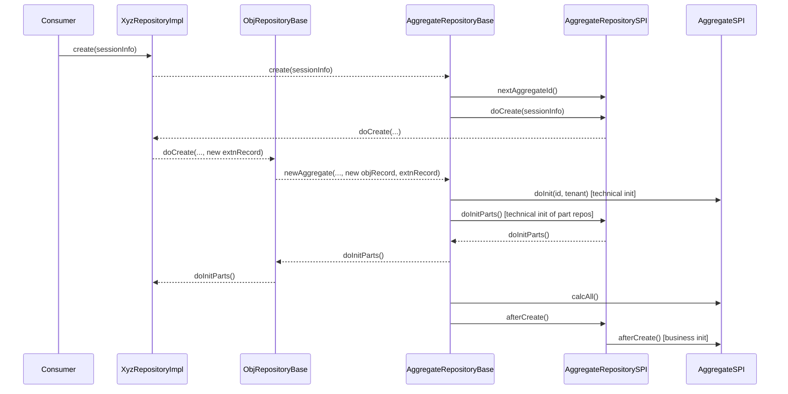
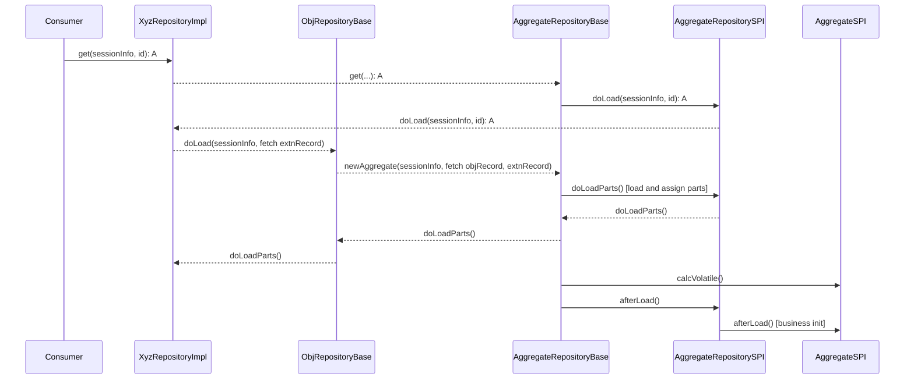
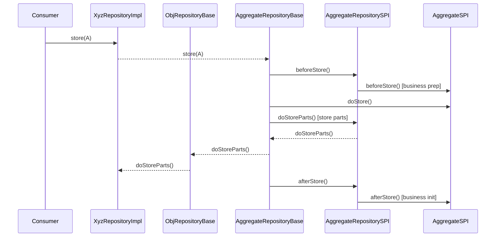

# Aggregate Lifecycle

## create

```mermaid
sequenceDiagram
	participant C as Consumer
	participant ER as XyzRepositoryImpl
	participant OR as ObjRepositoryBase
	participant AR as AggregateRepositoryBase
	participant ARS as AggregateRepositorySPI
	participant A as AggregateSPI
	C->>ER: create(sessionInfo)
	ER-->>AR: create(sessionInfo)
	AR->>ARS: nextAggregateId()
	AR->>ARS: doCreate(sessionInfo)
	ARS-->>ER: doCreate(...)
	ER-->>OR: doCreate(..., new extnRecord)
	OR-->>AR: newAggregate(..., new objRecord, extnRecord)
	AR->>A: doInit(id, tenant) [technical init]
	AR->>ARS: doInitParts() [technical init of part repos]
	ARS-->>AR: doInitParts()
	AR-->>OR: doInitParts()
	OR-->>ER: doInitParts()
	AR->>A: calcAll()
	AR->>ARS: afterCreate()
	ARS->>A: afterCreate() [business init]
```

## get

```mermaid
sequenceDiagram
	participant C as Consumer
	participant ER as XyzRepositoryImpl
	participant OR as ObjRepositoryBase
	participant AR as AggregateRepositoryBase
	participant ARS as AggregateRepositorySPI
	participant A as AggregateSPI
	C->>ER: get(sessionInfo, id): A
	ER-->>AR: get(...): A
	AR->>ARS: doLoad(sessionInfo, id): A
	ARS-->>ER: doLoad(sessionInfo, id): A
	ER-->>OR: doLoad(sessionInfo, fetch extnRecord)
	OR-->>AR: newAggregate(sessionInfo, fetch objRecord, extnRecord)
	AR->>ARS: doLoadParts() [load and assign parts]
	ARS-->>AR: doLoadParts()
	AR-->>OR: doLoadParts()
	OR-->>ER: doLoadParts()
	AR->>A: calcVolatile()
	AR->>ARS: afterLoad()
	ARS->>A: afterLoad() [business init]
```

## store

```mermaid
sequenceDiagram
	participant C as Consumer
	participant ER as XyzRepositoryImpl
	participant OR as ObjRepositoryBase
	participant AR as AggregateRepositoryBase
	participant ARS as AggregateRepositorySPI
	participant A as AggregateSPI
	C->>ER: store(A)
	ER-->>AR: store(A)
	AR->>ARS: beforeStore()
	ARS->>A: beforeStore() [business prep]
	AR->>A: doStore()
	AR->>ARS: doStoreParts() [store parts]
	ARS-->>AR: doStoreParts()
	AR-->>OR: doStoreParts()
	OR-->>ER: doStoreParts()
	AR->>ARS: afterStore()
	ARS->>A: afterStore() [business init]
```
