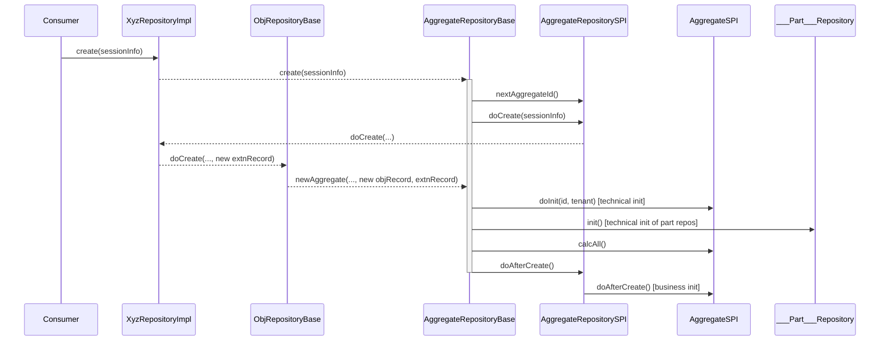
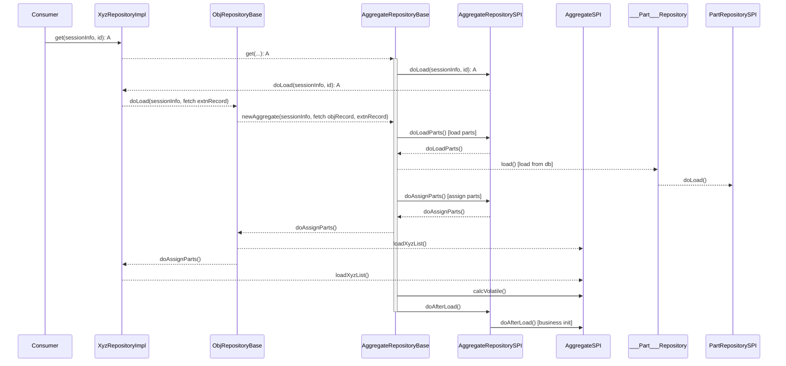
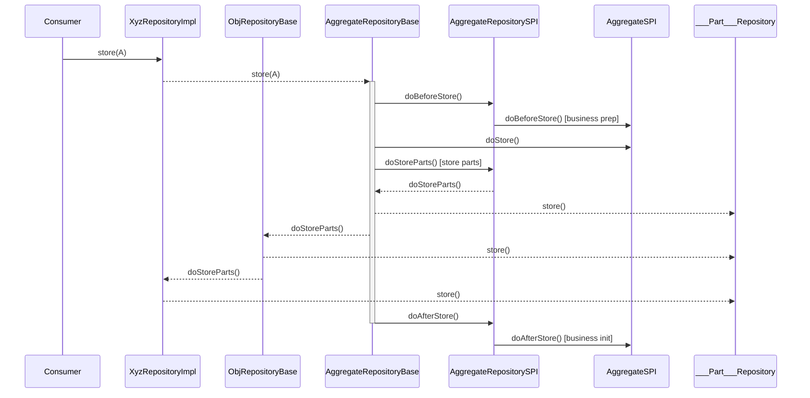
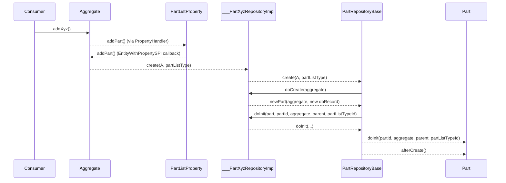

# Aggregate Lifecycle

## create

## get

todo
- doAfterLoad for Parts
- doLoadParts for Parts [assign to memory list]

## store

todo
- doBeforeStore for Parts
- doAfterStore for Parts

# Part Lifecycle

## create

todo
- PartRepositorySPI.doAfterCreate
- Part calcAll, calcVolatile
- PartRepositorySPI.doInitParts

## get

See aggregate get above

## store

See aggregate store above
