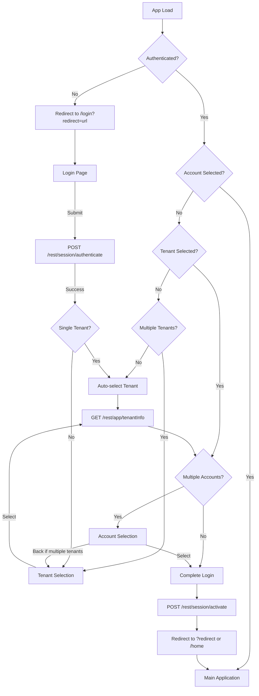
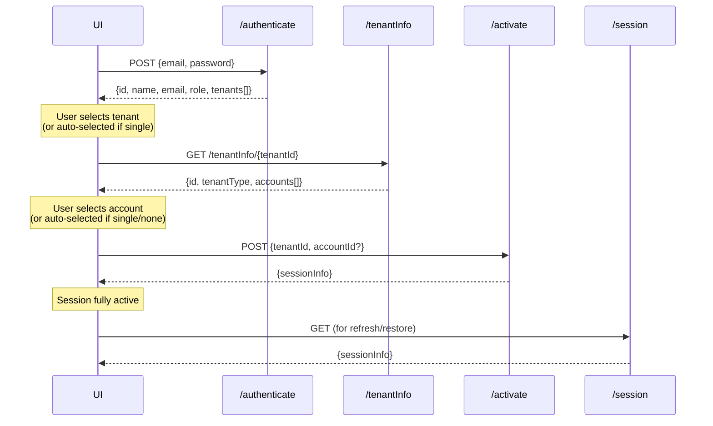
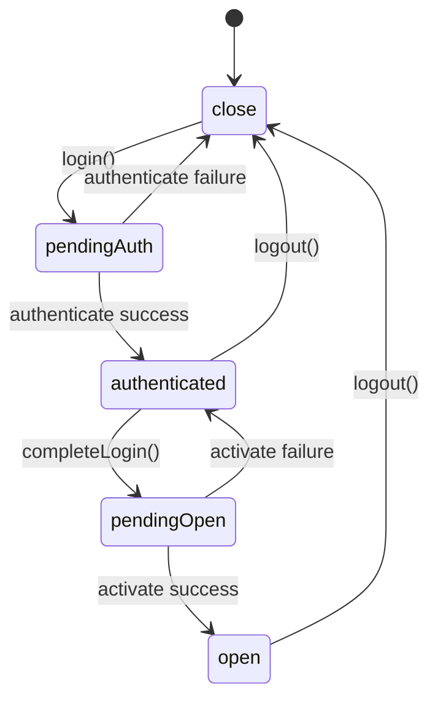
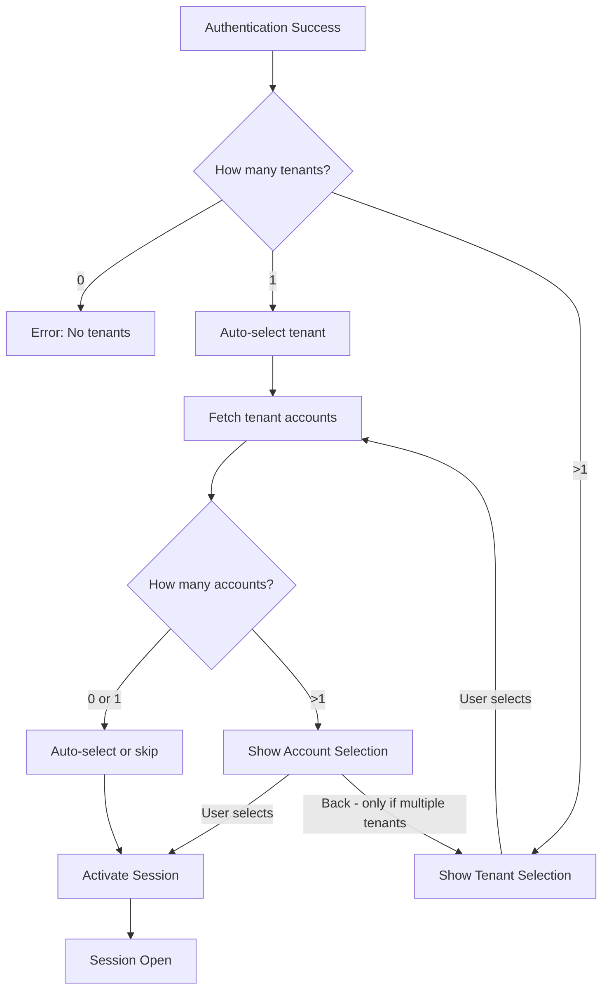

# Authentication Flow

This document describes the authentication mechanism for the FM application, including the decoupled login sequence that separates credential validation from tenant/account selection.

## Overview

The authentication flow is designed as a multi-step process:

1. **Authentication** - Validate user credentials (email/password)
2. **Tenant Selection** - Choose which tenant to work with (if user has access to multiple)
3. **Account Selection** - Choose which account to access (if tenant has multiple accounts)
4. **Session Activation** - Finalize the session with selected tenant/account

This decoupled approach allows the UI to present a wizard-style login experience while maintaining secure session management on the backend.

## UI Flow Diagram

The authentication flow uses a dedicated `/login` route. When accessing any protected URL without authentication, users are redirected to `/login?redirect=<original-url>`. After successful login, users are redirected back to their intended destination.

The authentication sequence has at most three steps. The wizard navigation only exists between steps 2 and 3 (tenant and account selection) - users cannot go back to the login page from the wizard.

**Login Behavior Summary:**
- If only one tenant AND one account available → immediate login (no wizard shown)
- If multiple tenants but only one account → tenant selection only, no back navigation needed
- If one tenant but multiple accounts → account selection only, no back navigation available
- If multiple tenants AND multiple accounts → full wizard with back navigation between tenant/account selection



## API Sequence Diagram



## API Endpoints

### POST /rest/session/authenticate

Validates user credentials and returns user information with available tenants.

**Request:**
```json
{
  "email": "user@example.com",
  "password": "secret"
}
```

**Response (200 OK):**
```json
{
  "id": 1,
  "name": "John Doe",
  "email": "user@example.com",
  "role": {
    "id": "ROLE_USER",
    "name": "User"
  },
  "tenants": [
    {
      "id": "1",
      "name": "Tenant A",
      "itemType": { "id": "ObjTenant", "name": "" }
    },
    {
      "id": "2", 
      "name": "Tenant B",
      "itemType": { "id": "ObjTenant", "name": "" }
    }
  ]
}
```

**Security:** This endpoint is publicly accessible (no authentication required).

**Side Effects:** 
- Creates an HTTP session
- Stores authentication in Spring Security context (without tenant/account)

---

### GET /rest/app/tenantInfo/{tenantId}

Returns tenant details including available accounts.

**Response (200 OK):**
```json
{
  "id": 1,
  "tenantType": {
    "id": "advisor",
    "name": "Advisor"
  },
  "accounts": [
    { "id": "1", "name": "Account A" },
    { "id": "2", "name": "Account B" }
  ]
}
```

**Security:** This endpoint is publicly accessible.

---

### POST /rest/session/activate

Activates the session with the selected tenant and optional account.

**Request:**
```json
{
  "tenantId": 1,
  "accountId": 2
}
```

**Response (200 OK):**
```json
{
  "applicationName": "FM Application",
  "applicationVersion": "1.0.0",
  "user": {
    "id": "1",
    "caption": "John Doe",
    "name": "John Doe",
    "email": "user@example.com",
    "role": { "id": "ROLE_USER", "name": "User" },
    "tenant": { "id": "1", "name": "Tenant A" }
  },
  "tenant": {
    "id": "1",
    "caption": "Tenant A",
    "name": "Tenant A",
    "tenantType": { "id": "advisor", "name": "Advisor" }
  },
  "account": {
    "id": "2",
    "caption": "Account B",
    "name": "Account B",
    "accountType": { "id": "standard", "name": "Standard" }
  },
  "locale": "de_CH",
  "applicationId": "fm",
  "availableApplications": ["fm"]
}
```

**Security:** Requires prior authentication via `/authenticate`.

**Side Effects:**
- Updates the Spring Security context with tenant/account
- Completes the session setup

---

### POST /rest/session/logout

Terminates the current session.

**Response (200 OK):** Empty body

**Side Effects:**
- Invalidates the HTTP session
- Clears the JSESSIONID cookie
- Clears the Spring Security context

---

### GET /rest/session/session

Returns current session information. Can be used to restore session state on page refresh.

**Response (200 OK):** Same as `/activate` response.

**Security:** Requires fully activated session (with tenant selected).

## Frontend State Machine

The frontend uses a Zustand store to manage session state through the following states:



### State Descriptions

| State | Description |
|-------|-------------|
| `close` | No active session, user not logged in |
| `pendingAuth` | Authentication request in progress |
| `authenticated` | Credentials validated, awaiting tenant/account selection |
| `pendingOpen` | Session activation in progress |
| `open` | Session fully active, user can access the application |

## Auto-Selection Logic

To streamline the user experience, the frontend automatically skips selection steps when possible:

1. **Single Tenant:** If the user has access to only one tenant, it is automatically selected (no tenant selection wizard shown)
2. **No Accounts / Single Account:** If the tenant has zero or one account, selection is skipped and the session is activated immediately

**Wizard Navigation Rules:**
- The wizard only handles steps 2 (tenant selection) and 3 (account selection)
- Back navigation is only available from account selection TO tenant selection, and only when multiple tenants exist
- The "Sign in with a different account" link provides logout functionality at any wizard step
- If both tenant and account are auto-selected, login is immediate (no wizard shown)



## Session Persistence

The frontend persists session state in `sessionStorage`:

- `fm-ux-session-state` - Current state (`close`, `authenticated`, `open`)
- `fm-ux-session-info` - Full session info JSON (when state is `open`)
- `fm-ux-tenant-info` - Tenant info with accounts (during selection)

On page load, the `initSession()` function checks for stored state and restores the session if valid.

## URL Routing

The authentication flow uses a dedicated `/login` route:

- **Protected Routes:** All routes except `/login` require an active session. Unauthenticated users are redirected to `/login`.
- **Redirect Parameter:** When redirecting to login, the original URL is preserved as `?redirect=<url>`. After successful login, users are redirected back to their intended destination (or `/home` if no redirect parameter).
- **Logout:** On logout, users are redirected to `/login`.
- **401 Response:** API 401 responses trigger a redirect to `/login?redirect=<current-path>`, clearing session storage in the process.

Example flow:
1. User visits `/building/123` without authentication
2. App redirects to `/login?redirect=%2Fbuilding%2F123`
3. User completes login
4. App redirects to `/building/123`

## Security Considerations

1. **Session Cookies:** The backend uses HTTP-only session cookies (`JSESSIONID`) for session management
2. **CORS:** The frontend sends requests with `withCredentials: true` to include cookies
3. **Pre-Session State:** After `/authenticate`, the user is authenticated but cannot access protected resources until `/activate` is called with a valid tenant
4. **401 Handling:** The frontend automatically redirects to `/login?redirect=<current-path>` on 401 responses, preserving the intended destination for post-login redirect

## Legacy Endpoint

The original `/rest/session/login` endpoint is still available for backwards compatibility. It requires `tenantId` to be provided upfront and combines authentication + activation in a single call.

```json
{
  "email": "user@example.com",
  "password": "secret",
  "tenantId": 1,
  "accountId": 2
}
```

This endpoint is deprecated in favor of the two-phase `/authenticate` + `/activate` flow.
