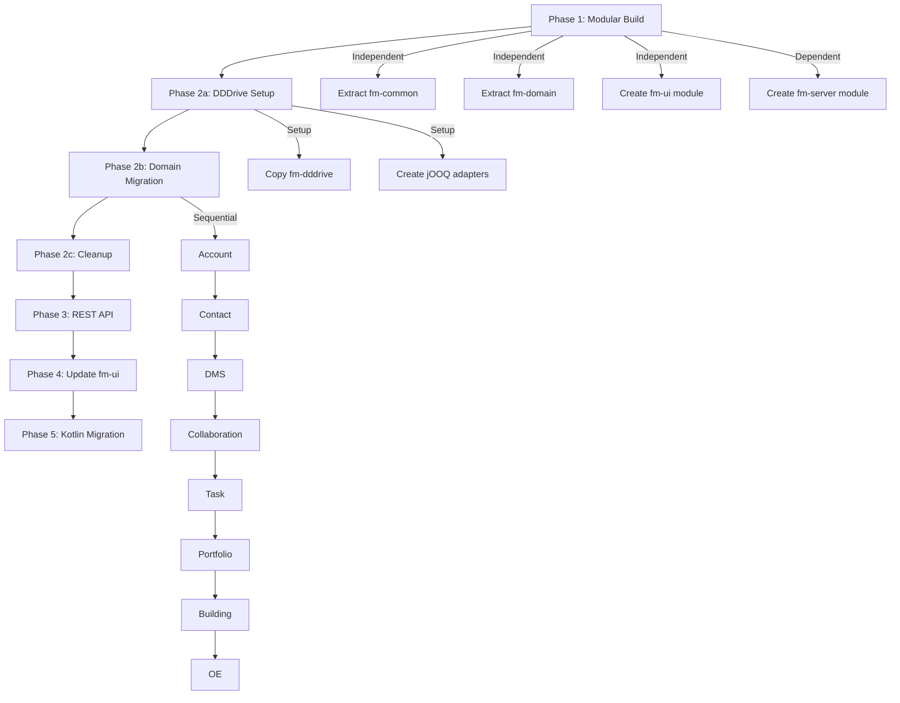

# fm-server Infrastructure Migration Plan

## Overview

Sequential migration of fm-server to match dfp-app-server infrastructure:
- Modular Maven build
- Embedded DDDrive
- REST API
- UI as separate module

While preserving:
- PostgreSQL backend (jOOQ + Flyway)
- Embedded UI (as fm-ui module)

## Current State (fm-server)

| Aspect | Current |
|--------|---------|
| Build | Single Maven module (`zeitwert-server`) |
| DDDrive | External dependency (`io.zeitwert:dddrive:1.0.18`) |
| API | JSON:API via Crnk framework |
| Database | PostgreSQL with jOOQ and Flyway |
| UI | Embedded in `src/main/ui` (React + Salesforce Lightning) |
| Language | Java with Lombok |

## Target State (matching dfp-app-server infrastructure)

| Aspect | Target |
|--------|--------|
| Build | Multi-module Maven parent |
| DDDrive | Embedded module (`fm-dddrive`) |
| API | REST via `@RestController` |
| Database | PostgreSQL (unchanged) |
| UI | Separate module (`fm-ui`) |
| Language | Kotlin (gradual) |

## Target Module Structure

```
fm-server/
├── pom.xml (parent)
├── fm-common/         # Shared utilities, enums, base classes
├── fm-dddrive/        # Embedded DDDrive framework (from dfp-dddrive)
├── fm-jooq-adapter/   # PostgreSQL/jOOQ persistence adapters for dddrive
├── fm-domain/         # Domain models (building, contact, portfolio, etc.)
├── fm-ui/             # React frontend (moved from src/main/ui)
│   ├── pom.xml        # Frontend Maven plugin configuration
│   ├── package.json
│   └── src/
└── fm-server/         # Spring Boot application
    └── (copies fm-ui build output to static/)
```

## Migration Phases

| Phase | Description | Status |
|-------|-------------|--------|
| [Phase 1](01-phase-1-modular-build.md) | Convert to multi-module Maven structure | Pending |
| [Phase 2a](02-phase-2a-dddrive-setup.md) | Embed DDDrive and create jOOQ adapters | Pending |
| [Phase 2b](03-phase-2b-domain-migration.md) | Migrate domains one-by-one | Pending |
| [Phase 2c](04-phase-2c-cleanup.md) | Remove old dddrive dependency | Pending |
| [Phase 3](05-phase-3-rest-api.md) | Replace JSON:API with REST | Pending |
| [Phase 4](06-phase-4-update-ui.md) | Update UI to consume REST API | Pending |
| [Phase 5](07-phase-5-kotlin.md) | Java to Kotlin migration (optional) | Pending |

## Migration Sequence Diagram



## Key Differences to Preserve

| Aspect | Keep from fm-server | Adopt from dfp-app-server |
|--------|---------------------|---------------------------|
| Database | PostgreSQL + jOOQ + Flyway | - |
| UI Location | Embedded (as `fm-ui` module) | Separate module pattern |
| Build | - | Multi-module Maven |
| DDDrive | - | Embedded module |
| API | - | REST Controllers |
| Language | - | Kotlin (gradual) |

## Risk Mitigation

1. **Database Compatibility**: Keep jOOQ and Flyway - no changes to persistence layer
2. **UI Stability**: Keep UI within project (as `fm-ui` module) - only change API consumption pattern
3. **UI Module Independence**: `fm-ui` can be built and tested independently of backend changes
4. **Incremental API Migration**: Migrate one domain at a time, keep both APIs running during transition
5. **Testing**: Ensure existing tests pass after each phase

