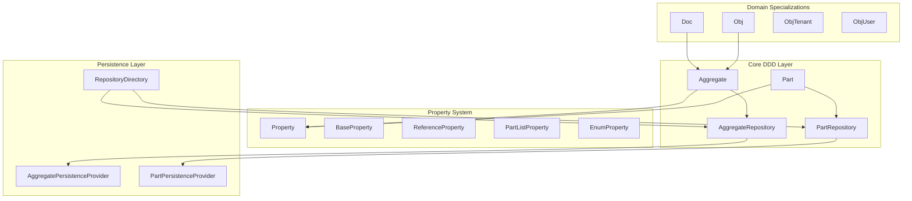

# DDDrive Framework Critical Review

## Executive Summary

The dddrive library is a sophisticated Domain-Driven Design (DDD) framework that provides a property-based approach to aggregate modeling with automatic change tracking, validation, and persistence abstraction. While the code has been converted to Kotlin syntax, it still heavily relies on Java patterns and paradigms. This review identifies architectural strengths, weaknesses, and opportunities for Kotlin-idiomatic improvements.

---

## Architecture Overview



---

## Key Findings

### 1. Dynamic Property System via Proxies

**Current Implementation:**

The framework uses Javassist proxies to intercept getter/setter calls on aggregates and route them through a centralized `PropertyHandler`:

```53:71:fm-dddrive/src/main/java/io/dddrive/property/model/impl/PropertyHandler.kt
// Method interception translates interface calls to property operations
override fun invoke(self: Any, m: Method, proceed: Method?, args: Array<Any?>): Any? {
    val methodName = m.name
    // ... extensive string-based method name parsing
}
```

**Issues:**

- Heavy reliance on reflection and runtime proxy generation
- String-based method name parsing is fragile and error-prone
- No compile-time type safety for property access
- Performance overhead from reflection on every property access

**Kotlin Alternative:** Consider using Kotlin delegated properties:

```kotlin
// Idiomatic Kotlin approach
class HouseholdAggregate : AggregateBase() {
    var name: String? by property()
    val memberList: PartList<HouseholdMember> by partList()
    var mainMember: HouseholdMember? by partReference()
}
```

**Note:** Delegated properties only delegate get/set - collection operations like `addMember()`, `getMember(index)` would need to go through the property accessor (e.g., `household.memberList.add()` instead of `household.addMember()`). This changes the external API but is arguably more Kotlin-idiomatic.

---

### 2. SPI Pattern and Lifecycle Callbacks (Combined Refactor)

**Current Implementation:**

The codebase uses Service Provider Interface (SPI) pattern with parallel interface hierarchies:

| Public Interface | SPI Interface |

|-----------------|---------------|

| `Aggregate` | `AggregateSPI` |

| `EntityWithProperties` | `EntityWithPropertiesSPI` |

| `AggregateMeta` | `AggregateRepositorySPI` |

| `Part` | `PartSPI` |

The lifecycle callbacks (`doInit`, `doAfterCreate`, `doBeforeStore`, etc.) use sequence counters to verify that `super.xxx()` was called at each inheritance level. This exists because forgetting `super.doBeforeStore()` causes subtle bugs (missing version increment, missing transitions) that are hard to debug - not immediate exceptions but weird data inconsistencies.

**Issues:**

- Requires frequent unsafe casts: `(aggregate as AggregateSPI).doAfterCreate(...)`
- Sequence counters add boilerplate to every lifecycle method at every level
- Multi-level inheritance (`AggregateBase` -> `ObjBase` -> `ObjHouseholdBase`) requires careful super propagation
- Internal and external APIs are conflated

**Kotlin Alternative:** Replace SPI with `internal` visibility and use a hook registry pattern.

#### Option A: Hook Registry on AggregateBase

Hooks are registered by each inheritance level in `init` blocks and collected in the aggregate:

```kotlin
abstract class AggregateBase {
    private val afterCreateHooks = mutableListOf<(Any, OffsetDateTime) -> Unit>()
    
    protected fun onAfterCreate(hook: (userId: Any, timestamp: OffsetDateTime) -> Unit) {
        afterCreateHooks.add(hook)
    }
    
    // Framework method - final, runs all hooks automatically
    internal fun afterCreate(userId: Any, timestamp: OffsetDateTime) {
        // Framework work always runs
        setValueByPath("ownerId", userId)
        setValueByPath("version", 0)
        // ...
        
        // All registered hooks run - no super calls needed
        afterCreateHooks.forEach { it(userId, timestamp) }
    }
}

abstract class ObjBase : AggregateBase() {
    init {
        onAfterCreate { userId, timestamp ->
            _transitionList.addPart(null).init(userId, timestamp)
        }
    }
}

abstract class ObjHouseholdBase : ObjBase() {
    init {
        onAfterCreate { userId, timestamp ->
            // Household-specific post-create logic
        }
    }
}
```

**Pros:**

- Self-contained, no repository involvement
- Hooks have natural access to internal state (lambdas capture `this`)
- No super calls needed - JVM guarantees `init` blocks run in inheritance order

**Cons:**

- Hook registration happens during object construction (every instance)
- Slight overhead per-instance (though lambdas are lightweight)

#### Option B: Hook Registry on AggregateRepository

Hooks are registered once per repository type, not per instance. The aggregate provides internal methods that hooks call:

```kotlin
abstract class AggregateRepositoryBase<A : Aggregate> {
    private val afterCreateHooks = mutableListOf<(A, Any, OffsetDateTime) -> Unit>()
    
    protected fun onAfterCreate(hook: (A, Any, OffsetDateTime) -> Unit) {
        afterCreateHooks.add(hook)
    }
    
    internal fun afterCreate(aggregate: A, userId: Any, timestamp: OffsetDateTime) {
        // Framework work + all registered hooks
        afterCreateHooks.forEach { it(aggregate, userId, timestamp) }
    }
}

abstract class ObjRepositoryBase<A : Obj> : AggregateRepositoryBase<A>() {
    init {
        onAfterCreate { obj, userId, timestamp ->
            obj.addTransitionAfterCreate(userId, timestamp)
        }
    }
}

// Aggregate just provides methods that encapsulate internal state access
abstract class ObjBase : AggregateBase() {
    internal fun addTransitionAfterCreate(userId: Any, timestamp: OffsetDateTime) {
        _transitionList.addPart(null).init(userId, timestamp)
    }
}
```

**Pros:**

- Hooks registered once per type (not per instance)
- Cleaner separation of concerns (behavior in repository, state in aggregate)

**Cons:**

- Aggregate methods must be `public` if repository is in different package
- Split between hook declaration (aggregate) and wiring (repository) adds indirection
- Could be addressed if delegated properties make business objects final and colocated with repository

#### Option C: Keep Counters, Remove SPI Only

Keep the current `super.doXxx()` pattern with sequence counter verification, but remove the SPI interfaces by using `internal` visibility. This preserves the natural OO programming model for consumers while cleaning up framework internals.

**Rationale:** The hook patterns (Options A & B) trade framework-internal boilerplate for consumer-visible boilerplate. The counter pattern keeps technical concerns invisible to domain developers - they just write natural `override` methods with `super` calls.

**Framework internals (before):**

```kotlin
// Repository casts to SPI to call lifecycle
val doAfterCreateSeqNr = (aggregate as AggregateBase).doAfterCreateSeqNr
(aggregate as AggregateSPI).doAfterCreate(userId, timestamp)
check(aggregate.doAfterCreateSeqNr > doAfterCreateSeqNr) { ... }
```

**Framework internals (after):**

```kotlin
// Direct call via internal visibility, counter check stays
val seqNr = aggregate.doAfterCreateSeqNr
aggregate.doAfterCreate(userId, timestamp)  // internal, no cast needed
check(aggregate.doAfterCreateSeqNr > seqNr) { 
    "${aggregate.className}: super.doAfterCreate() was not called" 
}
```

**Consumer code stays exactly the same:**

```kotlin
abstract class ObjHouseholdBase : ObjBase() {
    override fun doAfterCreate(userId: Any, timestamp: OffsetDateTime) {
        super.doAfterCreate(userId, timestamp)
        // Household-specific post-create logic - natural OO style
    }
}
```

**Pros:**

- Consumer writes natural OO code with `override` and `super` calls
- No framework concepts leak into business code
- Counter mechanism is invisible to consumers (framework internals only)
- Clear error messages when `super` is forgotten
- Minimal change from current implementation

**Cons:**

- Sequence counters remain in framework (but they work and are invisible)
- Still requires `super.doXxx()` calls (but this is familiar OO pattern)

**What Gets Eliminated (Option C):**

| Removed | Reason |

|---------|--------|

| `AggregateSPI` interface | Use `internal` visibility |

| `EntityWithPropertiesSPI` interface | Use `internal` visibility |

| `PartSPI` interface | Use `internal` visibility |

| `AggregateRepositorySPI` interface | Use `internal` visibility |

| Casts like `(aggregate as AggregateSPI)` | Direct calls via `internal` |

**What Stays (Option C):**

| Kept | Reason |

|------|--------|

| `doInitSeqNr`, `doAfterCreateSeqNr`, etc. | Invisible to consumers, provides clear error messages |

| `check(seqNr > oldSeqNr)` assertions | Catches missing `super` calls early |

| `super.doXxx()` pattern | Natural OO, familiar to developers |

---

**Summary of Options:**

| Aspect | Option A (Aggregate Hooks) | Option B (Repository Hooks) | Option C (Keep Counters) |

|--------|---------------------------|----------------------------|-------------------------|

| Consumer syntax | `init { onAfterCreate { } }` | Methods + repo wiring | `override fun doAfterCreate()` |

| Super calls needed | No | No | Yes |

| Framework complexity | Medium | Medium | Low (minimal change) |

| Consumer visibility | Hook registration visible | Method + wiring visible | Only natural OO visible |

| Per-instance overhead | Hook list per instance | None | Counter vars per instance |

---

### 3. Java-Style Enum Configuration

**Current Implementation:**

Enums use a custom `Enumerated` interface with companion object initialization:

```1:26:fm-dddrive/src/test/java/io/dddrive/domain/household/model/enums/CodeLabel.kt
enum class CodeLabel(
    override val id: String,
    private val itemName: String,
) : Enumerated {
    A("a", "Label A"),
    B("b", "Label B"),
    C("c", "Label C"),
    ;
    override val enumeration get() = Enumeration
    override fun getName() = itemName

    companion object Enumeration : EnumerationBase<CodeLabel>(CodeLabel::class.java) {
        init {
            CodeLabel.entries.forEach { addItem(it) }
        }
    }
}
```

**Issues:**

- Complex boilerplate for each enum
- Runtime registration pattern instead of compile-time
- `getName()` method conflicts with Kotlin `name` property convention

**Kotlin Alternative:** Use Kotlin's built-in enum capabilities with extension functions:

```kotlin
enum class CodeLabel(val displayName: String) {
    A("Label A"),
    B("Label B"),
    C("Label C")
}

// Extension for serialization if needed
val CodeLabel.enumId: String get() = name.lowercase()
```

---

### 4. Class-Based Type Parameters

**Current Implementation:**

Heavy use of `Class<T>` parameters for type information:

```63:70:fm-dddrive/src/main/java/io/dddrive/property/model/base/EntityWithPropertiesBase.kt
fun <T : Any> addBaseProperty(
    name: String,
    type: Class<T>,
): BaseProperty<T> {
    val property: BaseProperty<T> = BasePropertyImpl(this, name, type)
    addProperty(property)
    return property
}
```

**Kotlin Alternative:** Use reified type parameters:

```kotlin
inline fun <reified T : Any> addBaseProperty(name: String): BaseProperty<T> {
    return BasePropertyImpl(this, name, T::class.java).also { addProperty(it) }
}

// Usage becomes cleaner:
override fun doInit() {
    addBaseProperty<String>("name")
    addEnumProperty<CodeLabel>("labelSet")
}
```

---

### 5. Mutable State and Side Effects

**Current Implementation:**

Properties are defined imperatively in `doInit()` methods with side effects:

```21:28:fm-dddrive/src/test/java/io/dddrive/domain/household/model/base/ObjHouseholdBase.kt
override fun doInit() {
    super.doInit()
    this.addBaseProperty("name", String::class.java)
    this.addEnumSetProperty("labelSet", CodeLabel::class.java)
    this.addReferenceSetProperty("userSet", ObjUser::class.java)
    this.addPartReferenceProperty("mainMember", ObjHouseholdPartMember::class.java)
    _memberList = this.addPartListProperty("memberList", ObjHouseholdPartMember::class.java)
}
```

**Issues:**

- Mutable state (`lateinit var _memberList`)
- Order-dependent initialization
- No clear property schema at compile time

**Kotlin Alternative:** Declarative property definition using DSL:

```kotlin
class ObjHouseholdBase : ObjBase() {
    override val schema = aggregateSchema {
        property<String>("name")
        enumSet<CodeLabel>("labelSet")
        referenceSet<ObjUser>("userSet")
        partReference<ObjHouseholdPartMember>("mainMember")
        partList<ObjHouseholdPartMember>("memberList")
    }
}
```

---

### 6. Singleton Repository Directory

**Current Implementation:**

Global mutable singleton for dependency management:

```24:41:fm-dddrive/src/main/java/io/dddrive/ddd/model/RepositoryDirectory.kt
companion object {
    private var _instance: RepositoryDirectory = RepositoryDirectoryImpl()

    @JvmStatic
    val instance: RepositoryDirectory
        get() = _instance

    @JvmStatic
    fun setInstance(directory: RepositoryDirectory) {
        _instance = directory
    }
}
```

**Issues:**

- Global mutable state
- Testing difficulties (requires `reset()`)
- Not thread-safe
- Hides dependencies

**Kotlin Alternative:** Use dependency injection (already using Spring) consistently:

```kotlin
// Remove singleton, inject everywhere needed
class AggregateRepositoryBase<A : Aggregate>(
    private val directory: RepositoryDirectory,
    // ...
)
```

---

### 7. Path-Based Property Access

**Current Implementation:**

String-based path navigation with runtime parsing:

```45:52:fm-dddrive/src/main/java/io/dddrive/path/PathAccess.kt
fun <T : Any> EntityWithProperties.setValueByPath(
    path: String,
    value: T?,
) {
    val property = resolveProperty<T>(path, forSetter = true) 
        ?: error("Could not resolve path: $path")
    (property as BaseProperty<T>).value = value
}
```

**Issues:**

- No compile-time path validation
- Runtime errors for typos
- Unchecked casts

**Kotlin Alternative:** Type-safe property references:

```kotlin
// Using Kotlin property references
aggregate.set(ObjHousehold::name, "New Name")
aggregate.set(ObjHousehold::ownerId, userId)

// Or with operator overloading
aggregate[ObjHousehold::name] = "New Name"
```

---

### 8. Frozen State Management

**Current Implementation:**

Boolean flag controls mutability:

```142:151:fm-dddrive/src/main/java/io/dddrive/ddd/model/base/AggregateBase.kt
override val isFrozen: Boolean
    get() = _isFrozen

protected fun unfreeze() {
    _isFrozen = false
}

fun freeze() {
    _isFrozen = true
}
```

**Kotlin Alternative:** Use immutable data classes and copy-on-write:

```kotlin
// Immutable view for read operations
data class AggregateSnapshot(
    val id: Any,
    val name: String?,
    val members: List<MemberSnapshot>
)

// Mutable draft for modifications
class AggregateDraft(private val snapshot: AggregateSnapshot) {
    var name: String? = snapshot.name
    // ... changes tracked
    fun commit(): AggregateSnapshot = ...
}
```

---

## Improvement Recommendations

### High Priority

| Issue | Recommendation | Effort |

|-------|---------------|--------|

| SPI + Lifecycle callbacks | Hook registry pattern (Option A or B) | Medium |

| Proxy-based property access | Introduce Kotlin delegated properties | High |

| Class-based type parameters | Use reified generics | Low |

### Medium Priority

| Issue | Recommendation | Effort |

|-------|---------------|--------|

| Enum boilerplate | Simplify with Kotlin enums | Medium |

| Singleton directory | Consistent DI injection | Medium |

| String path navigation | Type-safe property references | High |

### Low Priority (Future Consideration)

| Issue | Recommendation | Effort |

|-------|---------------|--------|

| Mutable aggregate state | Consider immutable snapshots | Very High |

| Declarative property schema | DSL-based configuration | High |

---

## Summary of Strengths

1. **Well-structured DDD concepts** - Clear separation of Aggregate, Part, Repository
2. **Comprehensive change tracking** - Property change listeners for audit/sync
3. **Flexible persistence abstraction** - Swappable persistence providers
4. **Validation framework** - Built-in validation with levels
5. **Path-based access** - Useful for dynamic/JSON-API scenarios

## Summary of Weaknesses

1. **Java-centric patterns** - Extensive use of reflection, Class parameters
2. **Runtime over compile-time** - Many errors only caught at runtime
3. **Complex boilerplate** - Each aggregate requires multiple files (interface, base, impl, persistence)
4. **Global state** - Singleton directory, mutable configurations
5. **Type safety gaps** - Unchecked casts throughout the codebase

---

## Implementation Approach

If you want to proceed with improvements, I recommend an incremental approach:

1. **Phase 1:** Add reified generics to `addProperty` methods (backwards compatible)
2. **Phase 2:** Remove SPI interfaces + refactor lifecycle callbacks with hook registry

   - Choose Option A (hooks on AggregateBase) or Option B (hooks on Repository)
   - Replace `internal` visibility for framework methods
   - Remove sequence counters

3. **Phase 3:** Introduce delegated properties as alternative to proxy pattern
4. **Phase 4:** Create type-safe property reference DSL
5. **Phase 5:** Simplify enum pattern to idiomatic Kotlin