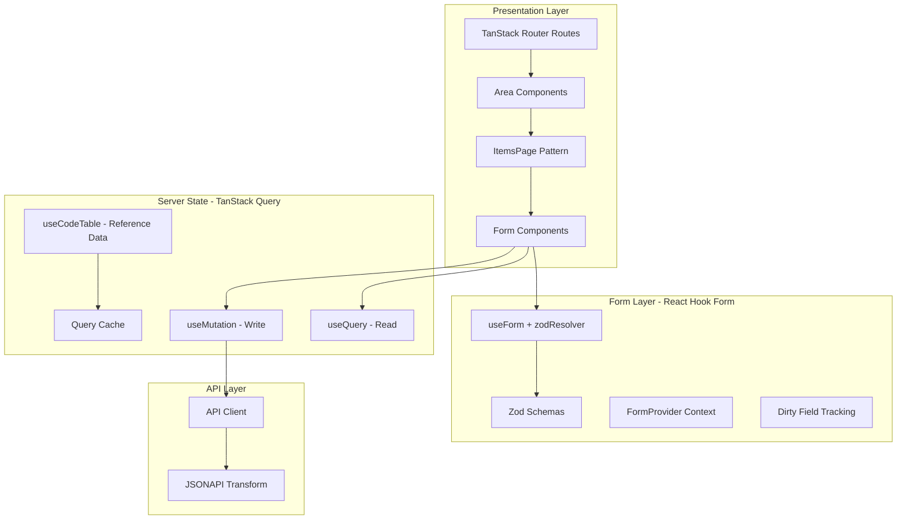

# FM-UX Forms Architecture Design

## 1. Core Architecture Overview



---

## 2. Key Design Decisions

### 2.1 Form State Separation (Key Pattern Change)

**Old (FM-UI)**: Form state directly mutates MST domain model, requiring transaction management

**New (FM-UX)**: Form state is ephemeral/local via React Hook Form, only synced to server on explicit save

```typescript
// NEW: Form state is local, server state separate
const { data: building } = useQuery(buildingQueryOptions(id));
const form = useForm<BuildingFormData>({
  resolver: zodResolver(buildingSchema),
  defaultValues: building, // Populated from server state
});

// Explicit save action
const mutation = useMutation({ mutationFn: api.updateBuilding });
const onSave = form.handleSubmit((data) => mutation.mutate(data));
const onCancel = () => form.reset(); // Just reset local state
```

### 2.2 Preserve Explicit Modify/Cancel/Store Pattern

The explicit transaction pattern is preserved but simplified:

| Action | Old (FM-UI) | New (FM-UX) |

|--------|-------------|-------------|

| **Edit** | `store.edit()` -> `startTrx()` | `setEditMode(true)` (local state) |

| **Cancel** | `store.cancel()` -> `rollbackTrx()` | `form.reset()` (reset to server data) |

| **Store** | `store.store()` -> API + `commitTrx()` | `mutation.mutate()` |

### 2.3 Field-Level Change Tracking

React Hook Form provides `formState.dirtyFields` out of the box:

```typescript
const { formState: { dirtyFields, isDirty } } = form;
// dirtyFields = { name: true, insuredValue: true, ... }

// Use for partial updates (only send changed fields)
const changedData = Object.keys(dirtyFields).reduce((acc, key) => {
  acc[key] = form.getValues(key);
  return acc;
}, {});
```

---

## 3. Core Infrastructure

### 3.1 Zod Schema Definitions

Location: `src/areas/{domain}/schemas.ts`

```typescript
// src/areas/building/schemas.ts
import { z } from 'zod';

// Base enumerated type (used for code tables/relations)
export const enumeratedSchema = z.object({
  id: z.string(),
  name: z.string(),
}).nullable();

export type Enumerated = z.infer<typeof enumeratedSchema>;

// Building schema with validation
export const buildingSchema = z.object({
  id: z.string().optional(),
  name: z.string().min(1, 'Name ist erforderlich'),
  buildingNr: z.string().min(1, 'Gebäudenummer ist erforderlich'),
  description: z.string().optional(),
  owner: enumeratedSchema,
  
  // Location
  street: z.string().optional(),
  zip: z.string().optional(),
  city: z.string().optional(),
  country: enumeratedSchema,
  
  // Values
  insuredValue: z.number().positive('Wert muss positiv sein'),
  insuredValueYear: z.number().int().min(1800).max(2100),
  currency: enumeratedSchema,
  
  // Classification
  buildingType: enumeratedSchema,
  buildingSubType: enumeratedSchema,
  
  // Nested sub-forms
  currentRating: z.object({
    partCatalog: enumeratedSchema,
    ratingDate: z.date().nullable(),
    ratingStatus: enumeratedSchema,
    elements: z.array(buildingElementSchema),
  }).optional(),
});

export type BuildingFormData = z.infer<typeof buildingSchema>;
```

### 3.2 Generic Code Table Query Hook

Location: `src/common/hooks/useCodeTable.ts`

```typescript
// Replaces EnumeratedField's auto-loading with generic TanStack Query
import { useQuery, UseQueryOptions } from '@tanstack/react-query';
import { api, getEnumUrl } from '../api/client';
import type { Enumerated } from '../types';

export function useCodeTable(
  source: string,
  options?: Omit<UseQueryOptions<Enumerated[]>, 'queryKey' | 'queryFn'>
) {
  const [module, enumName] = source.split('/');
  
  return useQuery({
    queryKey: ['codeTable', source],
    queryFn: async () => {
      const response = await api.get<Enumerated[]>(getEnumUrl(module, enumName));
      return response.data;
    },
    staleTime: 1000 * 60 * 30, // 30 min - code tables change rarely
    ...options,
  });
}

// Dependent code table (e.g., buildingSubType depends on buildingType)
export function useDependentCodeTable(
  source: string | ((params: Record<string, string>) => string),
  params: Record<string, string | undefined>,
  options?: Omit<UseQueryOptions<Enumerated[]>, 'queryKey' | 'queryFn'>
) {
  const resolvedSource = typeof source === 'function' 
    ? source(params as Record<string, string>) 
    : source;
  
  const enabled = Object.values(params).every(Boolean);
  
  return useQuery({
    queryKey: ['codeTable', resolvedSource, params],
    queryFn: async () => {
      const response = await api.get<Enumerated[]>(getEnumUrl('building', resolvedSource));
      return response.data;
    },
    enabled,
    staleTime: 1000 * 60 * 30,
    ...options,
  });
}
```

### 3.3 Form Components with Ant Design

Location: `src/common/components/form/`

```typescript
// src/common/components/form/FormSelect.tsx
import { Form, Select } from 'antd';
import { Controller, useFormContext } from 'react-hook-form';
import { useCodeTable } from '../../hooks/useCodeTable';

interface FormSelectProps {
  name: string;
  label: string;
  source: string;  // Code table source path
  required?: boolean;
  disabled?: boolean;
  onChange?: (value: Enumerated | null) => void;
}

export function FormSelect({ 
  name, 
  label, 
  source, 
  required, 
  disabled,
  onChange: externalOnChange 
}: FormSelectProps) {
  const { control, formState: { errors } } = useFormContext();
  const { data: options = [], isLoading } = useCodeTable(source);
  
  const error = errors[name]?.message as string | undefined;
  
  return (
    <Form.Item 
      label={label} 
      required={required}
      validateStatus={error ? 'error' : undefined}
      help={error}
    >
      <Controller
        name={name}
        control={control}
        render={({ field: { value, onChange } }) => (
          <Select
            value={value?.id}
            onChange={(id) => {
              const selected = options.find(o => o.id === id) ?? null;
              onChange(selected);
              externalOnChange?.(selected);
            }}
            loading={isLoading}
            disabled={disabled}
            allowClear={!required}
            options={options.map(o => ({ value: o.id, label: o.name }))}
          />
        )}
      />
    </Form.Item>
  );
}

// src/common/components/form/FormInput.tsx
import { Form, Input } from 'antd';
import { useFormContext } from 'react-hook-form';

interface FormInputProps {
  name: string;
  label: string;
  required?: boolean;
  disabled?: boolean;
  placeholder?: string;
}

export function FormInput({ name, label, required, disabled, placeholder }: FormInputProps) {
  const { register, formState: { errors } } = useFormContext();
  const error = errors[name]?.message as string | undefined;
  
  return (
    <Form.Item 
      label={label} 
      required={required}
      validateStatus={error ? 'error' : undefined}
      help={error}
    >
      <Input
        {...register(name)}
        disabled={disabled}
        placeholder={placeholder}
      />
    </Form.Item>
  );
}
```

---

## 4. ItemsPage Pattern Migration

### 4.1 New ItemsPage Component

Location: `src/common/components/items/ItemsPage.tsx`

```typescript
import { useState } from 'react';
import { Button, Card, Space, Table, Modal } from 'antd';
import { PlusOutlined } from '@ant-design/icons';
import { useQuery, useMutation, useQueryClient } from '@tanstack/react-query';

interface ItemsPageProps<T> {
  title: string;
  queryKey: string[];
  queryFn: () => Promise<T[]>;
  columns: ColumnType<T>[];
  createMutationFn: (data: Partial<T>) => Promise<T>;
  CreateForm: React.ComponentType<{ onSuccess: () => void; onCancel: () => void }>;
  onRowClick?: (record: T) => void;
  customActions?: React.ReactNode;
}

export function ItemsPage<T extends { id: string }>({
  title,
  queryKey,
  queryFn,
  columns,
  createMutationFn,
  CreateForm,
  onRowClick,
  customActions,
}: ItemsPageProps<T>) {
  const [isCreateOpen, setIsCreateOpen] = useState(false);
  const queryClient = useQueryClient();
  
  const { data = [], isLoading } = useQuery({ queryKey, queryFn });
  
  const createMutation = useMutation({
    mutationFn: createMutationFn,
    onSuccess: () => {
      queryClient.invalidateQueries({ queryKey });
      setIsCreateOpen(false);
    },
  });
  
  return (
    <Card
      title={title}
      extra={
        <Space>
          {customActions}
          <Button 
            type="primary" 
            icon={<PlusOutlined />}
            onClick={() => setIsCreateOpen(true)}
          >
            Neu erstellen
          </Button>
        </Space>
      }
    >
      <Table
        dataSource={data}
        columns={columns}
        loading={isLoading}
        rowKey="id"
        onRow={(record) => ({
          onClick: () => onRowClick?.(record),
          style: { cursor: onRowClick ? 'pointer' : 'default' },
        })}
      />
      
      <Modal
        title={`${title} erstellen`}
        open={isCreateOpen}
        onCancel={() => setIsCreateOpen(false)}
        footer={null}
      >
        <CreateForm
          onSuccess={() => setIsCreateOpen(false)}
          onCancel={() => setIsCreateOpen(false)}
        />
      </Modal>
    </Card>
  );
}
```

### 4.2 ItemPage with Edit/Cancel/Store Pattern

Location: `src/common/components/items/ItemPage.tsx`

```typescript
import { useState } from 'react';
import { useQuery, useMutation, useQueryClient } from '@tanstack/react-query';
import { FormProvider, useForm } from 'react-hook-form';
import { zodResolver } from '@hookform/resolvers/zod';
import { Card, Tabs, Button, Space, Spin, message } from 'antd';
import { EditOutlined, CloseOutlined, SaveOutlined } from '@ant-design/icons';
import type { ZodSchema } from 'zod';

interface ItemPageProps<T, S extends ZodSchema> {
  id: string;
  queryKey: string[];
  queryFn: (id: string) => Promise<T>;
  updateMutationFn: (data: Partial<T>) => Promise<T>;
  schema: S;
  tabs: TabDefinition[];
  header: (item: T, isEditing: boolean) => React.ReactNode;
}

export function ItemPage<T extends { id: string }, S extends ZodSchema>({
  id,
  queryKey,
  queryFn,
  updateMutationFn,
  schema,
  tabs,
  header,
}: ItemPageProps<T, S>) {
  const [isEditing, setIsEditing] = useState(false);
  const queryClient = useQueryClient();
  
  const { data: item, isLoading } = useQuery({
    queryKey: [...queryKey, id],
    queryFn: () => queryFn(id),
  });
  
  const form = useForm({
    resolver: zodResolver(schema),
    defaultValues: item as any,
  });
  
  // Reset form when server data changes
  useEffect(() => {
    if (item) form.reset(item);
  }, [item]);
  
  const mutation = useMutation({
    mutationFn: updateMutationFn,
    onSuccess: () => {
      queryClient.invalidateQueries({ queryKey: [...queryKey, id] });
      setIsEditing(false);
      message.success('Gespeichert');
    },
    onError: (error: any) => {
      message.error(error.detail || 'Fehler beim Speichern');
    },
  });
  
  // Handlers for explicit modify/cancel/store
  const handleEdit = () => setIsEditing(true);
  const handleCancel = () => {
    form.reset();
    setIsEditing(false);
  };
  const handleSave = form.handleSubmit((data) => {
    // Only send changed fields
    const dirtyFields = form.formState.dirtyFields;
    const changedData = Object.keys(dirtyFields).reduce((acc, key) => {
      acc[key] = data[key];
      return acc;
    }, { id } as Partial<T>);
    mutation.mutate(changedData);
  });
  
  if (isLoading) return <Spin size="large" />;
  if (!item) return <div>Nicht gefunden</div>;
  
  return (
    <FormProvider {...form}>
      <Card
        title={header(item, isEditing)}
        extra={
          <Space>
            {!isEditing && (
              <Button icon={<EditOutlined />} onClick={handleEdit}>
                Bearbeiten
              </Button>
            )}
            {isEditing && (
              <>
                <Button icon={<CloseOutlined />} onClick={handleCancel}>
                  Abbrechen
                </Button>
                <Button 
                  type="primary" 
                  icon={<SaveOutlined />} 
                  onClick={handleSave}
                  loading={mutation.isPending}
                  disabled={!form.formState.isDirty}
                >
                  Speichern
                </Button>
              </>
            )}
          </Space>
        }
      >
        <Tabs items={tabs.map(tab => ({
          key: tab.key,
          label: tab.label,
          children: <tab.Component item={item} isEditing={isEditing} />,
        }))} />
      </Card>
    </FormProvider>
  );
}
```

---

## 5. JSONAPI Integration Layer

Preserve the existing JSONAPI transformation but simplify usage:

Location: `src/common/api/jsonapi.ts`

```typescript
import normalize from 'json-api-normalizer';
import { Deserializer, Serializer } from 'jsonapi-serializer';

// Types
interface JsonApiResponse<T> {
  data: T | T[];
  included?: unknown[];
  meta?: { version?: number };
}

interface EntityRelations {
  [key: string]: string; // fieldName -> entityType
}

// Generic serializer factory
export function createSerializer<T>(
  entityType: string,
  relations: EntityRelations = {}
) {
  const attributes = []; // Will be populated from object keys
  
  return {
    serialize(data: T): JsonApiResponse<T> {
      const serializer = new Serializer(entityType, {
        attributes: Object.keys(data as object).filter(k => k !== 'id'),
        pluralizeType: false,
        keyForAttribute: 'camelCase',
        ...Object.fromEntries(
          Object.keys(relations).map(key => [key, { ref: true }])
        ),
      });
      return serializer.serialize(data);
    },
    
    async deserialize(response: JsonApiResponse<unknown>): Promise<T> {
      const deserializer = new Deserializer({
        keyForAttribute: 'camelCase',
      });
      return deserializer.deserialize(response);
    },
  };
}

// Usage in API layer
export const buildingSerializer = createSerializer<Building>('building', {
  owner: 'user',
  country: 'codeCountry',
  currency: 'codeCurrency',
});
```

---

## 6. Building Domain Example Implementation

### 6.1 API Functions

Location: `src/areas/building/api.ts`

```typescript
import { api, getApiUrl } from '../../common/api/client';
import { buildingSerializer } from '../../common/api/jsonapi';
import type { Building, BuildingFormData } from './schemas';

export const buildingApi = {
  async list(): Promise<Building[]> {
    const response = await api.get(getApiUrl('building', 'buildings'));
    return buildingSerializer.deserialize(response.data);
  },
  
  async get(id: string): Promise<Building> {
    const response = await api.get(getApiUrl('building', `buildings/${id}`));
    return buildingSerializer.deserialize(response.data);
  },
  
  async create(data: BuildingFormData): Promise<Building> {
    const payload = buildingSerializer.serialize(data);
    const response = await api.post(getApiUrl('building', 'buildings'), payload);
    return buildingSerializer.deserialize(response.data);
  },
  
  async update(data: Partial<Building> & { id: string }): Promise<Building> {
    const payload = buildingSerializer.serialize(data);
    const response = await api.patch(
      getApiUrl('building', `buildings/${data.id}`), 
      payload
    );
    return buildingSerializer.deserialize(response.data);
  },
};
```

### 6.2 Query Hooks

Location: `src/areas/building/queries.ts`

```typescript
import { queryOptions, useMutation, useQueryClient } from '@tanstack/react-query';
import { buildingApi } from './api';

export const buildingKeys = {
  all: ['building'] as const,
  lists: () => [...buildingKeys.all, 'list'] as const,
  detail: (id: string) => [...buildingKeys.all, 'detail', id] as const,
};

export const buildingListQueryOptions = queryOptions({
  queryKey: buildingKeys.lists(),
  queryFn: buildingApi.list,
});

export const buildingDetailQueryOptions = (id: string) => queryOptions({
  queryKey: buildingKeys.detail(id),
  queryFn: () => buildingApi.get(id),
});

export function useBuildingMutation() {
  const queryClient = useQueryClient();
  
  return useMutation({
    mutationFn: buildingApi.update,
    onSuccess: (data) => {
      queryClient.invalidateQueries({ queryKey: buildingKeys.detail(data.id) });
      queryClient.invalidateQueries({ queryKey: buildingKeys.lists() });
    },
  });
}
```

### 6.3 Building Route with Loader

Location: `src/routes/building/$buildingId.tsx`

```typescript
import { createFileRoute } from '@tanstack/react-router';
import { queryClient } from '../../common/queryClient';
import { buildingDetailQueryOptions } from '../../areas/building/queries';
import { BuildingPage } from '../../areas/building/ui/BuildingPage';

export const Route = createFileRoute('/building/$buildingId')({
  loader: async ({ params }) => {
    // Pre-fetch building data before rendering
    return queryClient.ensureQueryData(
      buildingDetailQueryOptions(params.buildingId)
    );
  },
  component: BuildingPage,
});
```

---

## 7. Directory Structure

```
src/
├── common/
│   ├── api/
│   │   ├── client.ts          # Axios instance
│   │   └── jsonapi.ts         # JSONAPI transformers
│   ├── components/
│   │   ├── form/              # Reusable form components
│   │   │   ├── FormInput.tsx
│   │   │   ├── FormSelect.tsx
│   │   │   ├── FormDatePicker.tsx
│   │   │   ├── FormNumber.tsx
│   │   │   └── index.ts
│   │   └── items/             # ItemsPage pattern
│   │       ├── ItemsPage.tsx
│   │       ├── ItemPage.tsx
│   │       └── ItemHeader.tsx
│   ├── hooks/
│   │   ├── useCodeTable.ts    # Reference data loading
│   │   └── useEditMode.ts     # Edit/Cancel/Store state
│   └── types/
│       └── index.ts           # Shared types (Enumerated, etc.)
│
├── areas/
│   └── building/
│       ├── api.ts             # API functions
│       ├── queries.ts         # TanStack Query hooks
│       ├── schemas.ts         # Zod schemas
│       └── ui/
│           ├── BuildingPage.tsx
│           ├── BuildingCreationForm.tsx
│           └── tabs/
│               ├── BuildingMainForm.tsx
│               ├── BuildingLocationForm.tsx
│               └── BuildingRatingForm.tsx
│
├── routes/
│   ├── building/
│   │   ├── index.tsx          # List route
│   │   └── $buildingId.tsx    # Detail route
│   └── __root.tsx
```

---

## 8. Migration Strategy

### Phase 1: Infrastructure

- Set up form component library (`common/components/form/`)
- Implement `useCodeTable` hook for reference data
- Create JSONAPI utility functions

### Phase 2: Simple Forms First

- Start with simpler areas (Contact, User)
- Validate patterns before tackling Building

### Phase 3: Complex Forms (Building)

- Migrate BuildingMainForm and BuildingLocationForm
- Handle BuildingRatingForm with nested elements
- Implement field-level change tracking

### Phase 4: List Views

- Migrate ItemsPage pattern
- Implement data tables with TanStack Query

---

## 9. Key Differences Summary

| Aspect | FM-UI (Old) | FM-UX (New) |

|--------|-------------|-------------|

| Form State | MST model + mstform | React Hook Form (local) |

| Validation | mstform converters | Zod schema |

| Server State | MST stores | TanStack Query |

| Reference Data | EnumeratedField auto-load | useCodeTable hook |

| Transaction | startTrx/commitTrx/rollback | Local form.reset() |

| Components | SLDS React | Ant Design |

| Routing | React Router + HOC | TanStack Router |

| Change Tracking | MST patch recorder | form.formState.dirtyFields |