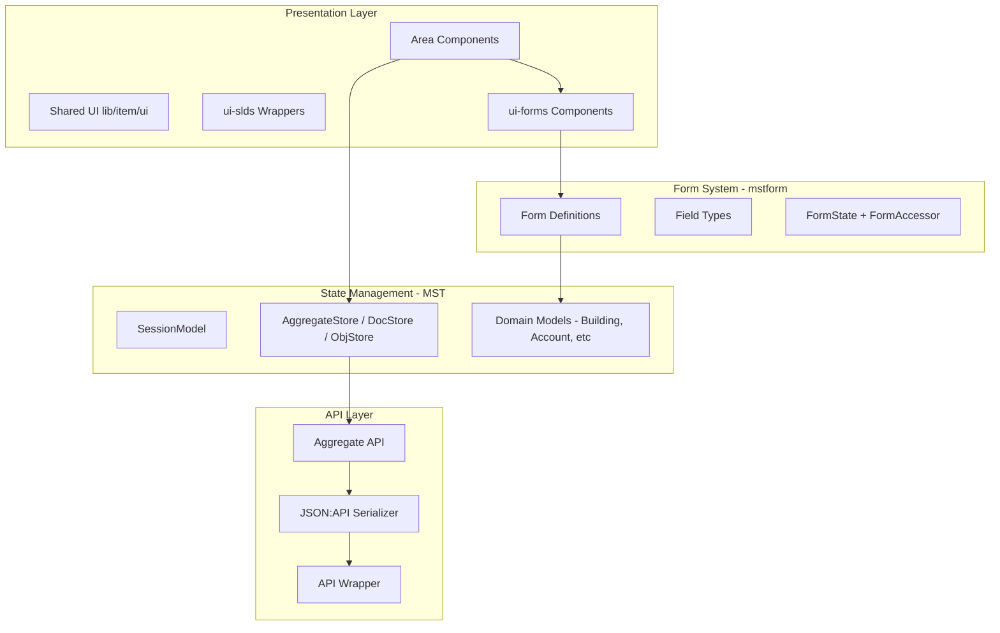
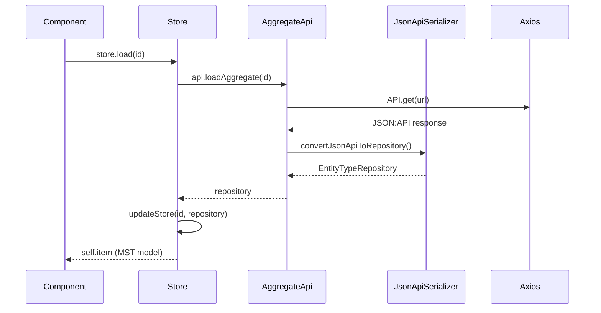
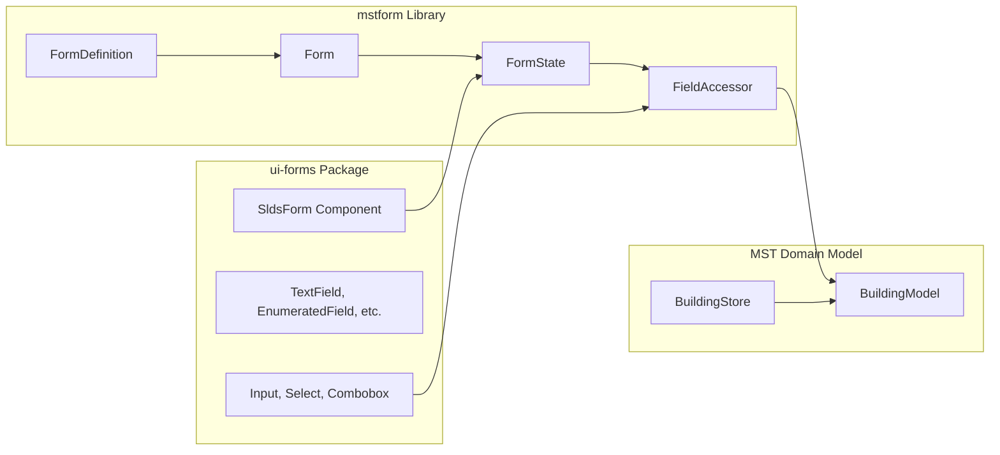
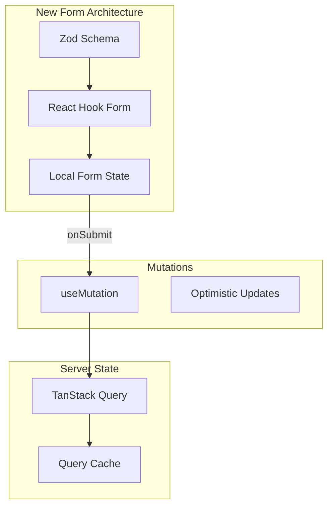
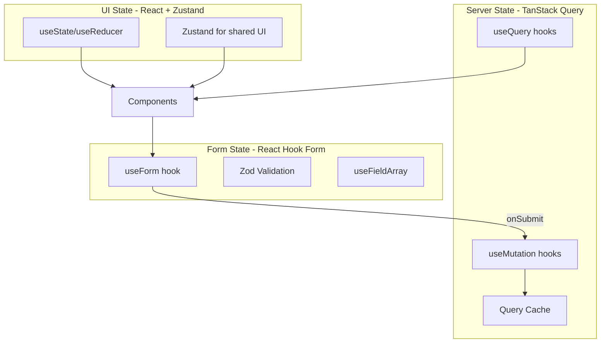

# ERP React TypeScript UI - Code Analysis Report

---

## 1. Executive Summary

### What the Application Does

This is a **Facility Management (FM) ERP application** for professional users, primarily in the Swiss/German-speaking market. It manages:

- **Buildings** (Immobilien) with property details, ratings, and valuations
- **Accounts** (customers/clients) 
- **Contacts** associated with buildings/accounts
- **Portfolios** of buildings
- **Tasks** and **Notes** for collaboration
- **Documents** (DMS functionality)

The application follows a **domain-driven design (DDD)** pattern with clear aggregate boundaries (Account, Building, Contact, Portfolio, User, Tenant).

### Architectural Structure




### What is Surprisingly Solid

1. **Domain Model Layering**: The `@zeitwert/ui-model` package has clean separation between:

- `app/` (session, config, i18n, utilities)
- `ddd/` (generic aggregate, doc, obj abstractions)
- `fm/` (domain-specific: building, account, contact, etc.)

2. **JSON:API Integration**: Proper use of JSON:API for API transport with normalization and denormalization
3. **Form Field Abstractions**: The custom field types (`TextField`, `EnumeratedField`, `NumberField`) provide consistent converters and validation
4. **Transaction Pattern**: The `AggregateStore` implements proper optimistic locking with `startTrx/commitTrx/rollbackTrx` and version conflict handling

### Highest Long-Term Risks

| Risk | Severity | Reason |
|------|----------|--------|
| Salesforce Lightning Design System React | **Critical** | Abandoned library (last release 2021), 110 import sites |
| mstform Library | **High** | Niche library, very low npm downloads, tightly coupled |
| Class Components + HOCs | **Medium** | ~90% class components, blocks React 18+ patterns |
| Create React App (via react-scripts) | **Medium** | CRA is deprecated, blocking Vite migration |

### Decisions That Made Sense Then But Are Questionable Now

1. **MobX-State-Tree for Everything**: MST was chosen for its structured state trees and runtime type checking. Today, this adds significant complexity for form state that could be local.
2. **mstform for Forms**: Using MST-backed form state seemed consistent but created tight coupling between form state and domain models.
3. **Salesforce Lightning Design System**: SLDS provided an enterprise-grade component library with Salesforce aesthetics. However, the React bindings (`design-system-react`) were effectively abandoned by Salesforce.
4. **Class Components with Decorators**: `@observer`, `@observable`, `@inject` decorators were idiomatic MobX 4-5 patterns. Modern MobX prefers function components with hooks.

---

## 2. Architectural Reality Check

### Component Organization

```javascript
src/
  @zeitwert/           # Internal packages
    ui-forms/          # Form system (SldsForm, Field, Input, Select, etc.)
    ui-model/          # State management and domain models
    ui-slds/           # SLDS wrapper components
  app/                 # Application shell (App, Header, Navigation, Auth)
  areas/               # Feature areas (building, account, contact, etc.)
  lib/                 # Shared UI utilities (ItemEditor, ItemHeader, ItemsPage)
```

**Pattern Observed**: Each "area" follows a consistent structure:

- `[Area]Area.tsx` - Route definitions and list view
- `[Area]Page.tsx` - Detail page with tabs
- `[Area]CreationForm.tsx` - New item form
- `tabs/` - Tab content components
- `forms/` - mstform definitions

This is **systematic and coherent**.

### State Ownership Boundaries

| State Type | Current Owner | Mechanism |
|------------|---------------|-----------|
| Session | `SessionModel` singleton | MST model, global |
| Server Data | `*Store` models (BuildingStore, etc.) | MST, per-component instance |
| Form State | `FormState` via mstform | MST-backed, tied to domain model |
| UI State | Component-local `@observable` | MobX, scattered |

**Problem**: Form state is tightly coupled to domain models. `SldsForm` directly modifies the MST model during editing, requiring the store's transaction system to rollback on cancel.

### Cross-Cutting Concerns

| Concern | Implementation | Assessment |
|---------|----------------|------------|
| **Forms** | mstform + custom `ui-forms` | Over-engineered, tightly coupled |
| **Validation** | mstform converters + field options | Sync-only, no schema-based |
| **Error Handling** | Per-component try/catch + toast | Inconsistent, no error boundary strategy |
| **Permissions** | `session.hasUserRole`, `session.hasAdminRole` | Scattered across components |
| **i18n** | `Translator` + hardcoded German strings | Incomplete; most UI is German literals |

### Routing Model

**Current**: React Router v6 with a custom `withRouter` HOC bridge for class components.

```19:src/app/frame/withRouter.tsx
export const withRouter = (Component: any) => {
```

Routes are defined inline in each Area component using `<Routes>` and `<Route>`. The `DynamicView` component uses lazy loading:

```30:32:src/app/frame/DynamicView.tsx
const AreaComponent = React.lazy(() =>
  import(`../../areas/${componentPath}` /* webpackChunkName: "[request]" */)
);
```

**Assessment**: Functional but not type-safe. No route type inference or loader pattern.

### Styling Strategy

- **Primary**: Salesforce Lightning Design System CSS (`salesforce-lightning-design-system.min.css`)
- **Customization**: SCSS overrides in `src/assets/` (14 SCSS files)
- **Component Library**: `@salesforce/design-system-react` for interactive components
- **Custom CSS Classes**: `slds-*` utility classes throughout JSX

**Coupling Depth**: SLDS class names appear in 98+ files. The `_slds-fix.scss` file contains ~180 lines of overrides for SLDS quirks.

### Data Fetching Pattern



**Assessment**: Well-structured but synchronous loading patterns. No caching, no background refetching, no stale-while-revalidate.

### Testing Strategy

```1:src/__tests__/App.test.tsx
// Single smoke test file
```

**Coverage**: Minimal. One smoke test that mounts the App. No component tests, no integration tests, no form validation tests.---

## 3. Dependency Health and Ecosystem Risk

### Critical Dependencies

| Package | Version | Status | Risk |
|---------|---------|--------|------|
| `@salesforce/design-system-react` | 0.10.50 | **Abandoned** (last release Mar 2021) | **Critical** |
| `@salesforce-ux/design-system` | 2.19.0 | Active (CSS only) | Low |
| `mstform` | 1.33.1 | **Low Activity** (~50 weekly downloads) | **High** |
| `mobx-state-tree` | 5.1.7 | Active | Low |
| `mobx` | 6.7.0 | Active | Low |
| `react-scripts` | 5.0.1 | **Deprecated** (CRA is unmaintained) | Medium |
| `react-router-dom` | 6.6.1 | Active | Low |
| `typescript` | 4.9.4 | Outdated (current is 5.x) | Low |

### Salesforce Design System React - Deep Dive

**Evidence of Abandonment**:

- Last npm publish: March 2021 (v0.10.50)
- GitHub repo shows minimal activity
- React 18 compatibility issues (uses deprecated APIs)
- Community has migrated to alternatives (Lightning Web Components for Salesforce, other libraries for general use)

**Codebase Coupling**:

- 110 import sites across 98 files
- Used for: Button, Modal, Spinner, Card, Tabs, DataTable, Combobox, Icon, etc.
- Custom wrappers in `@zeitwert/ui-slds/` partially abstract some components

**Migration Surface Area**: **High**. Every interactive component (buttons, modals, tabs, forms) uses SLDS React.

### mstform - Deep Dive

**What It Does**: Connects MST models to forms with converters, validation, and field accessors.**Risk Factors**:

- Very niche library (~50 weekly npm downloads)
- Single maintainer
- No TypeScript types published (relies on inference)
- Tightly couples form state to MST model structure

**Coupling Depth**:

- Used in 50+ files
- All form definitions depend on `Form`, `FormDefinition`, `Field` from mstform
- `SldsForm` wrapper is the only form mechanism

### Upgrade Blockers

1. **React 18**: SLDS React uses deprecated `ReactDOM.render` and string refs
2. **TypeScript 5**: Blocked by older type definitions and decorator patterns
3. **Vite**: Blocked by CRA's webpack config and `config-overrides.js`

---

## 4. React and TypeScript Pattern Evaluation

### Component Style Distribution

| Style | Count (approx) | Files |
|-------|----------------|-------|
| Class + `@observer` | ~90% | Most pages and forms |
| Functional + observer() | ~10% | Some ui-forms components |
| Pure Functional | Rare | Utility components only |

**Example Class Component Pattern**:

```26:src/@zeitwert/ui-forms/Form.tsx
@observer
export class SldsForm<M extends IAnyModelType> extends React.Component<SldsFormProps<M>> {
```


### Composition Patterns

| Pattern | Usage | Assessment |
|---------|-------|------------|
| HOCs (`withRouter`, `@inject`) | Common | Legacy, should be hooks |
| Render Props | Rare | `SldsForm` supports render prop children |
| Custom Hooks | **None** | Major gap |
| Context | Limited | Only `FormContext` for form accessors |

### Type Quality

**Good**:

- MST models are well-typed with `Instance<T>` and `SnapshotIn<T>`
- Form definitions use generics properly

**Problematic**:

```29:src/app/ui/ItemEditor.tsx
get ctx() {
  return this.props as any as AppCtx;
}
```

This pattern appears in multiple places - casting to `any` to access injected context.

```11:src/app/frame/withRouter.tsx
export const withRouter = (Component: any) => {
```

Type safety is lost through the HOC.

### Legacy Patterns Observed

1. **Decorator-based MobX**: `@observable`, `@observer`, `@action`, `@computed`
2. **Class Properties with `makeObservable`**: Required manual call in constructor
3. **`@inject` for Context**: Provider-based dependency injection
4. **Lifecycle Methods**: `componentDidMount`, `componentDidUpdate` instead of hooks

**Assessment**: Harmless from a runtime perspective, but significantly increases cognitive load for modern React developers and prevents adoption of concurrent features.---

## 5. Form State Management Deep Dive

### Current Architecture




### Where Form State Lives

Form state is **directly bound to the MST domain model**. The `SldsForm` component creates a `FormState` that wraps the model:

```69:83:src/@zeitwert/ui-forms/Form.tsx
private attachState(props: SldsFormProps<M>) {
  this.formState = props.formModel.state(
    props.item,
    Object.assign(
      {},
      {
        converterOptions: {
          decimalSeparator: ".",
          thousandSeparator: "'",
          renderThousands: true,
        }
      },
      this.props.formStateOptions
    )
  );
```


### How Fields Are Registered

Fields are defined declaratively in form definition files:

```16:70:src/areas/building/ui/forms/BuildingForm.ts
export const BuildingFormDef: FormDefinition<BuildingModelType> = {
  id: new IdField(),
  name: new TextField({ required: true }),
  description: new TextField(),
  owner: new EnumeratedField({ required: true, source: "oe/objUser" }),
  // ... 30+ more fields
  currentRating: new SubForm({
    partCatalog: new EnumeratedField({ required: true, source: "building/codeBuildingPartCatalog" }),
    // nested fields...
  })
};
```


### Validation Strategy

- **Converter-based**: Each field type has a converter that validates on input
- **Synchronous only**: No async validation support observed
- **No schema**: Validation rules are scattered across field definitions

### Signs of Overengineering

1. **Globalized Form State**: Every form modifies the central MST model. There's no local form state - editing a building modifies `buildingStore.building` directly, requiring transaction management.
2. **Transaction Ceremony**: The `AggregateStore` must `startTrx()`, `commitTrx()`, or `rollbackTrx()` around form edits. This is infrastructure for what should be isolated form state.
3. **Dependent Field Queries**: The `EnumeratedField` implements complex auto-loading reactions:
```84:91:src/@zeitwert/ui-forms/Form.tsx
this.formState.fieldAccessors.forEach(fieldAccessor => {
  if ((fieldAccessor.references as any)?.dependentQuery) {
    fieldAccessor.references.autoLoadReaction();
  }
});
```


4. **Custom DSL for Sources**: `EnumeratedSource` creates a mini-framework for loading dropdown options with query dependencies.

### Modern Alternatives Analysis

| Approach | Fit for ERP Context | Considerations |
|----------|---------------------|----------------|
| **React Hook Form** | Good | Uncontrolled inputs, minimal re-renders, schema validation via Zod/Yod |
| **Tanstack Form** | Good | Headless, framework-agnostic, good TypeScript support |
| **Formik** | Moderate | Popular but heavier, controlled inputs |
| **MobX-based (keeping MST)** | Moderate | Could simplify with `mobx-react-lite` hooks |

**Recommended Separation**:



---

## 6. Styling and UI Toolkit Evaluation

### Current Approach

| Layer | Technology | Files |
|-------|------------|-------|
| CSS Framework | SLDS CSS 2.19.0 | Loaded globally |
| Component Library | `@salesforce/design-system-react` 0.10.50 | 98 files |
| Customizations | SCSS (14 files) | 500+ lines of overrides |
| Layout | SLDS grid classes + custom `Grid`/`Row`/`Col` | Throughout |

### Coupling Analysis

**Heavy Usage Components**:

- `Button`, `ButtonGroup` - all action buttons
- `Card` - every content section
- `Spinner` - all loading states
- `Tabs`, `TabsPanel` - all detail pages
- `Modal` - all dialogs
- `DataTable` - all list views
- `Combobox` - all autocomplete selects
- `Icon`, `IconSettings` - throughout

**Custom Wrappers in ui-slds**:

- `Grid`, `Row`, `Col` - layout primitives
- `PageHeader` - custom page header
- `Timeline` - activity timeline
- `CasePath` - BPM stage indicator
- `CustomDataTableCells` - custom cell renderers

### UI Toolkit Replacement Candidates

Given ERP context requirements (complete component set, data-dense layouts, table support, form controls):

| Toolkit | Pros | Cons | ERP Fit |
|---------|------|------|---------|
| **Ant Design** | Complete ERP-ready set, excellent tables, forms, i18n | Large bundle, opinionated aesthetics | **Excellent** |
| **Chakra UI** | Modern DX, accessible, customizable | Fewer data-dense components | Good |
| **Mantine** | Modern, growing, good forms/tables | Smaller ecosystem | Good |
| **Blueprint** | Built for data-dense apps | Older architecture | Good |
| **Radix + Custom** | Maximum flexibility | High implementation effort | Moderate |

### Recommendation

**Ant Design** is the strongest fit because:

1. Battle-tested in ERP/admin contexts
2. Complete form system with validation
3. Excellent Table/DataGrid component
4. Built-in i18n support (useful for German UI)
5. Active maintenance and large community
6. Similar density to SLDS aesthetics

**Migration Path**:

1. Introduce Ant Design alongside SLDS
2. Migrate low-level components first (Button, Card, Spinner)
3. Migrate complex components (Table, Form) with parallel implementations
4. Remove SLDS dependencies file by file

---

## 7. Modern Reference Architecture (If Built Today)

### Build and Runtime

```javascript
vite + React 18 + TypeScript 5
```


- **Vite** for fast HMR and optimized builds
- **TypeScript 5** with strict mode and no experimental decorators
- **ESLint + Prettier** with modern React rules

### Routing

```typescript
// TanStack Router with type-safe routes
import { createFileRoute } from '@tanstack/react-router'

export const Route = createFileRoute('/building/$buildingId')({
  loader: async ({ params }) => {
    return queryClient.ensureQueryData(buildingQueryOptions(params.buildingId))
  },
  component: BuildingPage,
})
```

**Benefits**:

- Type-safe route params
- Loader pattern for data fetching
- Integrated with TanStack Query

### State Management Architecture




### Server State: TanStack Query

```typescript
// queries/building.ts
export const buildingQueryOptions = (id: string) => ({
  queryKey: ['building', id],
  queryFn: () => api.getBuilding(id),
  staleTime: 1000 * 60 * 5, // 5 minutes
})

// In component
const { data: building, isLoading } = useQuery(buildingQueryOptions(buildingId))
```

**Why TanStack Query**:

- Caching and background refetching
- Optimistic updates for mutations
- Request deduplication
- DevTools for debugging
- Natural fit with loader pattern

### Form State: React Hook Form + Zod

```typescript
// schemas/building.ts
export const buildingSchema = z.object({
  name: z.string().min(1, 'Required'),
  buildingNr: z.string().min(1, 'Required'),
  insuredValue: z.number().positive(),
  // ...
})

// In component
const form = useForm<BuildingFormData>({
  resolver: zodResolver(buildingSchema),
  defaultValues: building,
})

const mutation = useMutation({
  mutationFn: api.updateBuilding,
  onSuccess: () => queryClient.invalidateQueries(['building', buildingId]),
})

const onSubmit = form.handleSubmit((data) => mutation.mutate(data))
```

**Why This Separation**:

1. Form state is ephemeral - only relevant during editing
2. Server state persists across navigation
3. Clear submission boundary (`mutation.mutate`)
4. Validation happens before server round-trip

### UI State: Keep It Simple

```typescript
// Local state for most UI concerns
const [activeTab, setActiveTab] = useState('main')
const [isPreviewOpen, setIsPreviewOpen] = useState(false)

// Zustand only for truly shared state (rare in ERP)
// Example: sidebar collapsed state, user preferences
```


### UI Toolkit: Ant Design

```typescript
import { Form, Input, Select, Button, Card, Table } from 'antd'
import { ConfigProvider } from 'antd'
import deDE from 'antd/locale/de_DE'

// App-level config
<ConfigProvider locale={deDE} theme={customTheme}>
  <App />
</ConfigProvider>
```


### Testing Stack

| Layer | Tool | Purpose |
|-------|------|---------|
| Unit | Vitest | Fast unit tests |
| Component | React Testing Library | Component behavior |
| Integration | MSW | API mocking |
| E2E | Playwright | Critical paths |

### Directory Structure

```javascript
src/
  routes/           # TanStack Router file-based routes
    building/
      $buildingId.tsx
      index.tsx
  features/         # Feature modules
    building/
      api.ts        # API functions
      queries.ts    # TanStack Query hooks
      schemas.ts    # Zod schemas
      components/   # Feature components
  components/       # Shared UI components
  lib/              # Utilities
```

---

## 8. Evidence-Based Findings

### Form System Overengineering Evidence

**File**: [`src/@zeitwert/ui-forms/Form.tsx`](src/@zeitwert/ui-forms/Form.tsx)

- 130 lines to wrap mstform with SLDS styling
- Manual lifecycle management for `attachState`/`detachState`
- Auto-reaction setup for dependent queries

**File**: [`src/areas/building/ui/forms/BuildingForm.ts`](src/areas/building/ui/forms/BuildingForm.ts)

- 75 lines of form definition
- Custom field types with embedded data sources
- Nested `SubForm` and `RepeatingForm` abstractions

### SLDS Abandonment Evidence

**File**: [`package.json`](package.json) line 20:

```json
"@salesforce/design-system-react": "^0.10.50",
```


- Version 0.10.50 released March 2021
- No updates in 4+ years
- React 18 compatibility issues

### MST Complexity Evidence

**File**: [`src/@zeitwert/ui-model/ddd/aggregate/model/AggregateStore.ts`](src/@zeitwert/ui-model/ddd/aggregate/model/AggregateStore.ts)

- 300 lines for generic aggregate store
- Transaction management, patch recording, optimistic locking
- Required for form editing due to state coupling

**File**: [`src/@zeitwert/ui-model/fm/building/model/BuildingModel.ts`](src/@zeitwert/ui-model/fm/building/model/BuildingModel.ts)

- 250 lines for Building domain model
- MobX reactions for geocoding and rating date propagation
- Domain logic mixed with UI concerns

### Type Safety Issues Evidence

**File**: [`src/lib/item/ui/ItemEditor.tsx`](src/lib/item/ui/ItemEditor.tsx) line 19-21:

```typescript
get ctx() {
  return this.props as any as AppCtx;
}
```

**File**: [`src/areas/building/ui/BuildingArea.tsx`](src/areas/building/ui/BuildingArea.tsx) line 29-30:

```typescript
get ctx() {
  return this.props as any as AppCtx;
}
```

Pattern repeated across inject-dependent components.

### Missing Test Coverage Evidence

**Directory**: [`src/__tests__/`](src/__tests__/)

- Single file: `App.test.tsx`
- Content: Basic smoke test only
- No form tests, no validation tests, no API integration tests

---

## Summary of Key Recommendations

1. **Immediate**: Plan migration from `@salesforce/design-system-react` to Ant Design
2. **High Priority**: Replace mstform with React Hook Form + Zod
3. **Medium Priority**: Migrate from CRA to Vite
4. **Medium Priority**: Adopt TanStack Query for server state
5. **Ongoing**: Convert class components to functional components with hooks